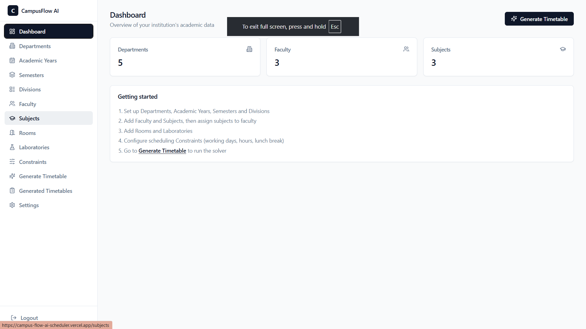
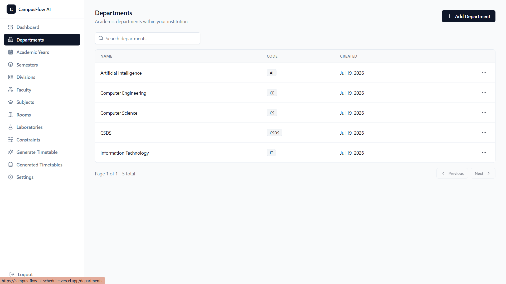
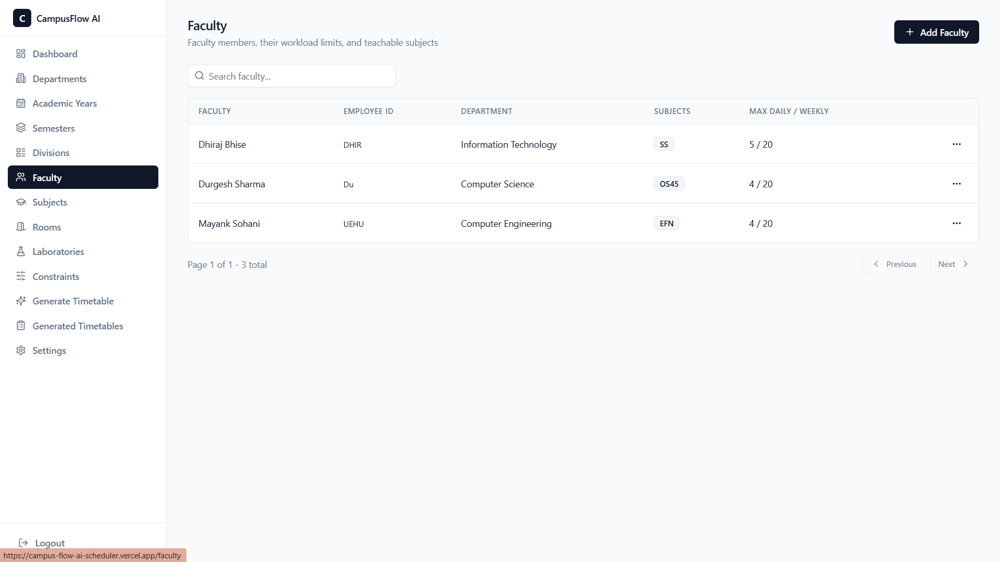
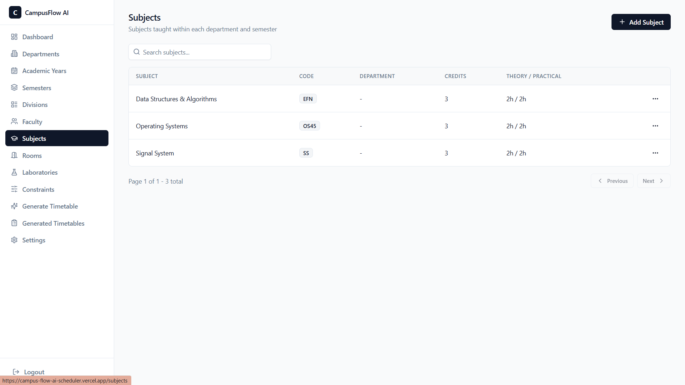
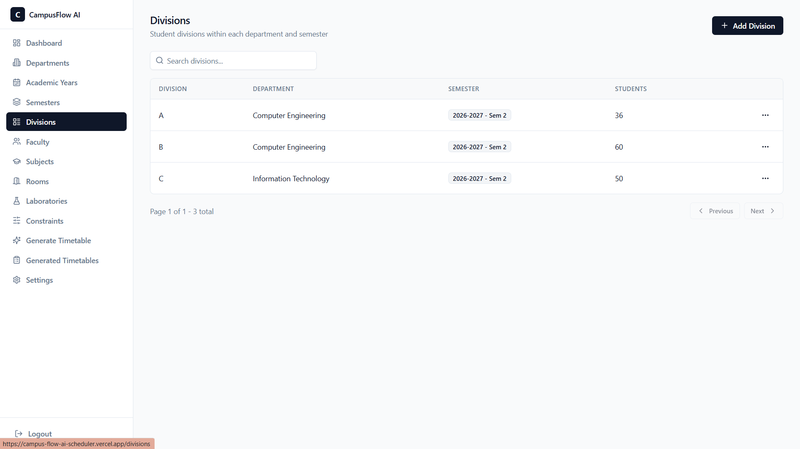
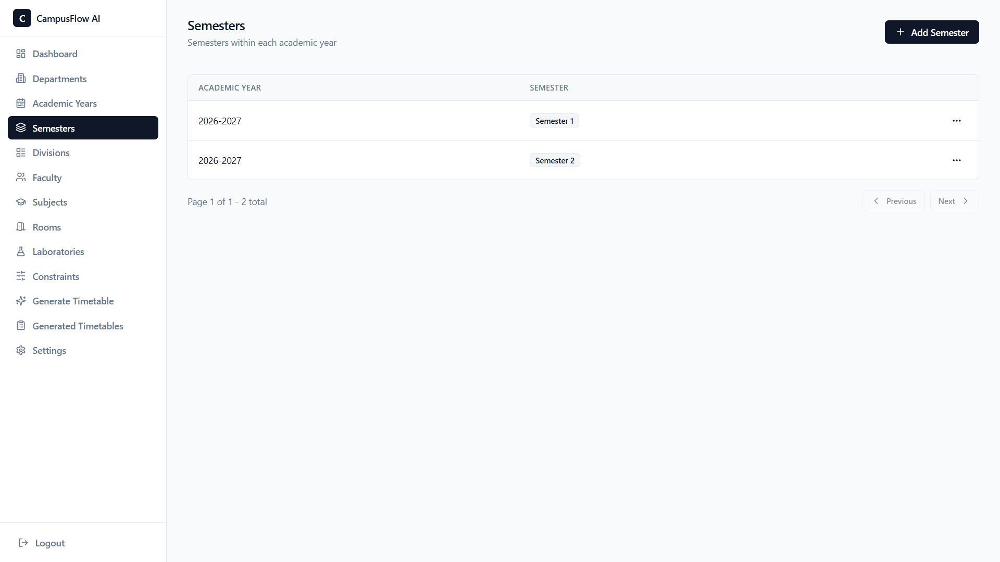
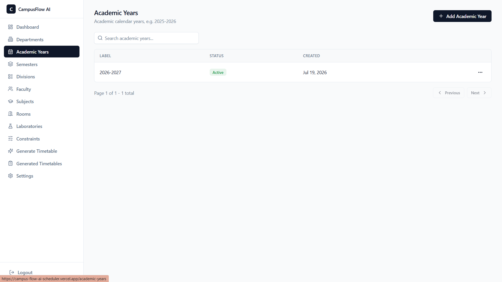
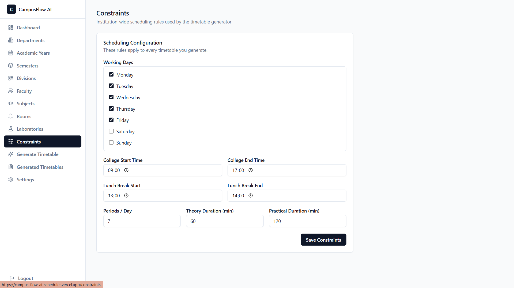
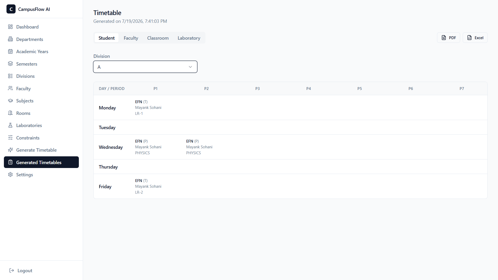
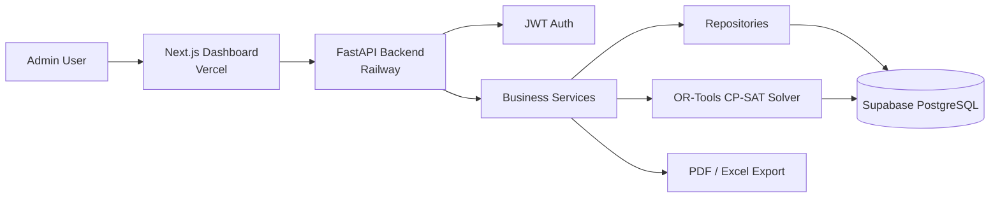

# CampusFlow AI

**CampusFlow AI is an intelligent academic scheduling platform that automatically generates optimized and conflict-free college timetables.**

It takes faculty availability, rooms, subjects, divisions, semesters, and scheduling constraints as input, uses **Google OR-Tools CP-SAT** constraint optimization to generate feasible timetables, and provides a web-based interface for managing academic data, configuring scheduling constraints, generating timetables, and reviewing results. The platform includes a **FastAPI** backend, **Next.js** frontend, and **PostgreSQL** database with **JWT-based authentication**, and is deployed on **Railway** and **Vercel**.

---

## 🌐 Live Deployment

| Service | URL |
|---------|-----|
| **Frontend** | https://campus-flow-ai-scheduler.vercel.app/ |
| **Backend API** | https://campusflow-ai-production.up.railway.app/ |
| **Swagger Docs** | https://campusflow-ai-production.up.railway.app/docs |
| **Health Check** | https://campusflow-ai-production.up.railway.app/health |

---

## 📸 Screenshots

### Dashboard


### Departments


### Faculty


### Subjects


### Divisions


### Semesters


### Academic Years


### Constraint Configuration


### Generated Timetable Output


---

## 🏗️ Architecture



---

## 🚀 Features

- **Authenticated admin dashboard** with JWT login and throttled login protection
- **8 full CRUD modules**: Departments, Academic Years, Semesters, Divisions, Subjects, Faculty, Rooms & Laboratories, Scheduling Constraints
- **Faculty–subject assignment management** via multi-select checklist
- **Singleton institution-wide scheduling constraints** (working days, period count, lunch, period durations)
- **CP-SAT timetable optimization**: precondition validation → boolean-assignment model with hard no-overlap constraints on faculty / room / division and faculty workload caps → time-boxed solve → persistent result
- **Four timetable views**: Student (Division), Faculty, Classroom, Laboratory — all from a single filterable endpoint
- **PDF and Excel export** for every view, styled to match the application theme
- **Snapshot-backed timetable history**: every generation run is stored with its entries
- **Server-side pagination, search, sorting**, loading skeletons, empty states, toast notifications
- **Graceful error feedback**: precondition failures surface actionable messages (missing faculty, no lab, etc.)

---

## 🛠️ Tech Stack

**Backend**
- Python 3.12 · FastAPI · SQLAlchemy 2 · Alembic · PostgreSQL
- Google OR-Tools 9 (CP-SAT solver)
- Pydantic v2 · Pydantic Settings · python-jose (JWT) · passlib + bcrypt
- openpyxl (Excel) · ReportLab (PDF)

**Frontend**
- Next.js 15 (App Router) · React 19 · TypeScript
- Tailwind CSS · Radix UI primitives
- React Hook Form · Zod · TanStack Table · Axios · Sonner

**Infrastructure**
- **Backend**: Docker → Railway
- **Frontend**: Vercel (Next.js native deployment)
- **Database**: Supabase PostgreSQL (IPv4 pooler, port 6543)
- Docker Compose for local full-stack development

---

## ⚙️ Local Setup

### Option A — Docker Compose (recommended)

Docker Compose starts PostgreSQL, runs Alembic migrations, and boots the backend on `:8000` and frontend on `:3000`.

```bash
# 1. Generate a bcrypt hash for the admin password
docker compose build backend
docker compose run --rm backend python scripts/create_admin_hash.py "YourStrongPassword"
```

Create a `.env` file at the repository root:

```env
ADMIN_PASSWORD_HASH=<paste hash from above>
JWT_SECRET_KEY=<a long random secret>
```

Start the stack:

```bash
docker compose up --build
```

Visit `http://localhost:3000` and sign in with `admin@campusflow.ai` and the password you hashed.

---

### Option B — Manual Setup

#### Backend

```bash
cd backend
python -m venv .venv && source .venv/bin/activate   # Windows: .venv\Scripts\activate
pip install -r requirements.txt
cp .env.example .env
# Edit .env: set DATABASE_URL, then generate and set ADMIN_PASSWORD_HASH
python scripts/create_admin_hash.py "YourStrongPassword"
alembic upgrade head
uvicorn app.main:app --reload --port 8000
```

| Endpoint | URL |
|----------|-----|
| Swagger UI | http://localhost:8000/docs |
| Health check | http://localhost:8000/health |

#### Frontend

```bash
cd frontend
npm ci
cp .env.local.example .env.local
# Edit .env.local if your backend is not on http://localhost:8000
npm run dev
```

Visit `http://localhost:3000` — you will be redirected to `/login`.

---

## 🔒 Security Notes

- Never commit plaintext passwords, database URLs, JWT secrets, or bcrypt hashes.
- All `.env` files are Git-ignored. Use `.env.example` / `.env.local.example` as templates only.
- `ADMIN_PASSWORD_HASH` must be a bcrypt hash from `scripts/create_admin_hash.py` — the raw password is never stored.
- In `ENVIRONMENT=production` mode the application enforces:
  - `JWT_SECRET_KEY` ≥ 32 characters, not the default placeholder
  - A non-empty `ADMIN_PASSWORD_HASH` that is a valid bcrypt hash
  - `CORS_ORIGINS` without `"*"`

---

## ✅ Verification

```bash
# Frontend
cd frontend
npm run lint
npm run typecheck
npm run build

# Backend
cd backend
python -m compileall .
```

---

## 🧭 End-to-End Usage

1. **Sign in** at the dashboard.
2. **Add data** — at minimum: one Department, Academic Year, Semester, Division, Subject (with theory/practical hours), Faculty (assigned to that subject), a Classroom, and optionally a Laboratory.
3. **Configure Constraints** — working days, periods per day, period duration, lunch break.
4. **Generate Timetable** — select the academic year and click Generate. Precondition errors surface a precise list of missing data.
5. **View results** — browse Student / Faculty / Classroom / Laboratory tabs on the detail page.
6. **Export** — download any view as PDF or Excel.

---

## 🗂️ Code Structure

```
backend/
  app/
    core/          # config, database session, security, auth dependency
    models/        # SQLAlchemy ORM models
    schemas/       # Pydantic request/response schemas
    repositories/  # data-access layer (BaseRepository + per-entity repos)
    services/
      solver/      # CP-SAT: data_loader → model_builder → solver_service
      export/      # grid_builder → pdf_export / excel_export
    routers/       # FastAPI route handlers (thin, delegate to services)
    utils/
    main.py        # app factory, CORS, exception handlers, lifespan
  alembic/         # database migrations
  scripts/         # admin utilities (create_admin_hash.py)
  Dockerfile

frontend/
  app/
    login/                          # public login page
    (dashboard)/                    # auth-guarded route group
      layout.tsx                    # sidebar shell + auth guard
      dashboard/  departments/  academic-years/  semesters/  divisions/
      subjects/   faculty/      rooms/           laboratories/
      constraints/  generate/   timetables/      timetables/[id]/
      settings/
  components/
    ui/          # Radix-based primitive components
    layout/      # Sidebar, PageHeader, nav config
    data-table/  # Generic DataTable + ConfirmDeleteDialog
    modules/     # Per-module form dialogs + timetable grid/export UI
  hooks/
    use-crud-resource.ts   # Unified list / search / paginate / CRUD
    use-options-list.ts    # FK dropdown data fetching
  lib/
    api-client.ts   # Axios instance, JWT interceptor, response unwrapping
    auth.ts         # Token storage helpers
    types.ts        # TypeScript types mirroring backend schemas
    validators/     # Zod schemas per module
  Dockerfile
```

---

## 🚢 Production Deployment

### Frontend → Vercel

Set the environment variable in your Vercel project settings:

```
NEXT_PUBLIC_API_URL=https://campusflow-ai-production.up.railway.app/api/v1
```

### Backend → Railway

Set the following environment variables in Railway:

| Variable | Description |
|----------|-------------|
| `ENVIRONMENT` | `production` |
| `DATABASE_URL` | Supabase IPv4 pooler connection string (port 6543) |
| `JWT_SECRET_KEY` | Random secret ≥ 32 characters |
| `ADMIN_EMAIL` | Admin login email |
| `ADMIN_PASSWORD_HASH` | bcrypt hash from `create_admin_hash.py` |
| `CORS_ORIGINS` | `["https://campus-flow-ai-scheduler.vercel.app"]` |
| `SOLVER_MAX_TIME_SECONDS` | (optional) default 120 |
| `SOLVER_NUM_WORKERS` | (optional) default 8 |

Railway builds and runs the backend using `backend/Dockerfile`. The Dockerfile entry point already handles Railway's dynamically assigned `PORT`:

```dockerfile
CMD sh -c "uvicorn app.main:app --host 0.0.0.0 --port ${PORT:-8000}"
```

No start command override is needed in Railway. Database migrations (`alembic upgrade head`) should be run manually when schema changes are deployed — for example via a one-off Railway job or the Railway console — rather than as part of the regular container start command.

### Database → Supabase

Use the **IPv4 connection pooler** (port `6543`, mode `transaction`) to avoid IPv6 connectivity issues on Railway.

---

## 🤖 AI / Optimization Notes

The scheduling engine uses **Google OR-Tools CP-SAT** — a production-grade constraint programming solver, not a generative AI or ML model. The system is accurately described as *AI-powered optimization*:

- Hard constraints enforced: no faculty, room, or division double-booking within the same time slot
- Soft constraints: faculty daily and weekly workload caps
- The solver is time-boxed (`SOLVER_MAX_TIME_SECONDS`) and fails gracefully if infeasible or timed out
- Precondition validation runs before the solver to surface data issues immediately, avoiding wasted solve time

---

## 📄 License

MIT
